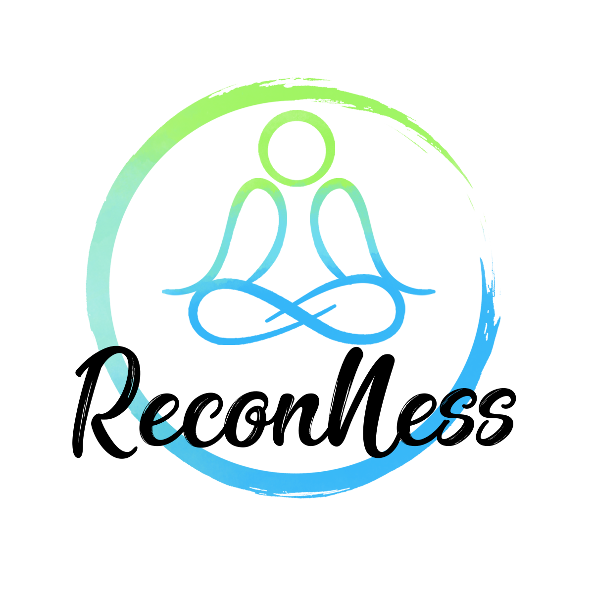

# ReconNess Web App

  

## Why ReconNess?

Well, we have seen a lot of #bugbounty hackers organizing his #recon using txt and doing a lot of bash scripts to filter the output to keep everything organized with the intention to focus only on the potentially vulnerable targets. But realistically this demands a lot of bash skill and strong folders/files organization process to avoid the feeling of chaos.

ReconNess helps you to run and keep all your #recon in the same place allowing you to focus only on the potentially vulnerable targets without distraction and without required a lot of bash skill or programing skill in general. 

With ReconNess you can put all your learning effort only on how to exploit the targets using one specific kind of vulnerability for example and at the same time you are sure that your #recon is good and organized.

## Continuous Recon (CR)

ReconNess is a platform to allow continuous recon (CR) where you can set up a pipeline of #recon tools (Agents) and trigger it base on schedule or events.

## Quick Start

Check this [link](https://docs.reconness.com/getting-started/quick-start) to know how put ReconNess running and start collecting #recon data from yours targets.

## Development

NodeJs Current and LTS Releases

[https://nodejs.org/download/release/](https://nodejs.org/download/release/)

DotNet 6

[https://dotnet.microsoft.com/download/dotnet/6.0](https://dotnet.microsoft.com/download/dotnet/6.0)

We are working in the **NEW UI**, you can check here the progress
[http://134.209.46.128/](http://134.209.46.128/)

## Work in Progress (!!!!!NEW UI!!!!)

### Home

### Targets

### Agents

## Join us

If you want to know what is next or you want to help us, please join us.

[Discord](https://discord.com/invite/hpKVRFM)

[Twitter](https://twitter.com/reconness)

## Licensing

MIT License

